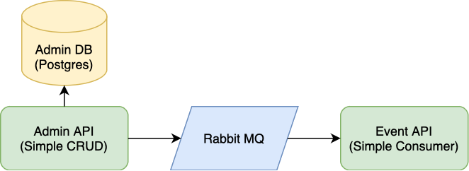

# Steeltoe Interview

## Overview


- [Admin DB](AdminDb) is a simple Postgres DB. It uses it's own docker image to aid schema and initial data setup.
- [Admin API](AdminApi) is a simple ASP.NET Core CRUD API. It uses EF Core to work with Admin DB.
- Once an entity is added/modified/deleted, Admin API raises an event in rabbit queue with entity state and data snapshot. Rabbit instance from `docker-compose` uses management instance and UI is available on port `15672`.
- [Event API](EventApi) is another simple ASP.NET Core API that lets you consume events from above-mentioned queue.

## See In Action
1. Build & run:
```
docker-compose -f "docker-compose.yml" up -d --build
```
2. Navigate to Admin API's swagger in your browser:
```
http://localhost:50200/swagger
```
3. Create/modify/remove any user record via `POST/PUT/DELETE api/Users`.
4. Navigate to Event API's swagger in your browser:
```
http://localhost:50201/swagger
```
5. Consume, observe events raised by Admin API via `GET api/Events/Consume`.
6. Stop & remove containers:
```
docker-compose -f "docker-compose.yml" down
```

## Notes
- All .NET components are .NET 6.
- I used VSCode, hence there's no SLN.
- Swagger UI is available in all builds unless turned off in `AppSettings`.
- Stelltoe's info and healthchecks are included and are available in swagger (they were not discovered automatically, I added redirects to actuator URLs to have them visible).
- There's a conflict between `Npgsql.EntityFrameworkCore.PostgreSQL` and `Steeltoe.Management.EndpointCore` in Admin API, they require different versions of `Microsoft.Extensions.Logging`. I wanted to use .NET 6 with Steeltoe, so `Microsoft.Extensions.Logging` reference is explicit.
- If you don't have docker (or don't want to use it), rabbit and postgres connection strings are available in `AppSettings`.
- I had to flip `EnableUnsafeBinaryFormatterSerialization` to `true` in Admin API to get Steeltoe's rabbit serializer to work.
